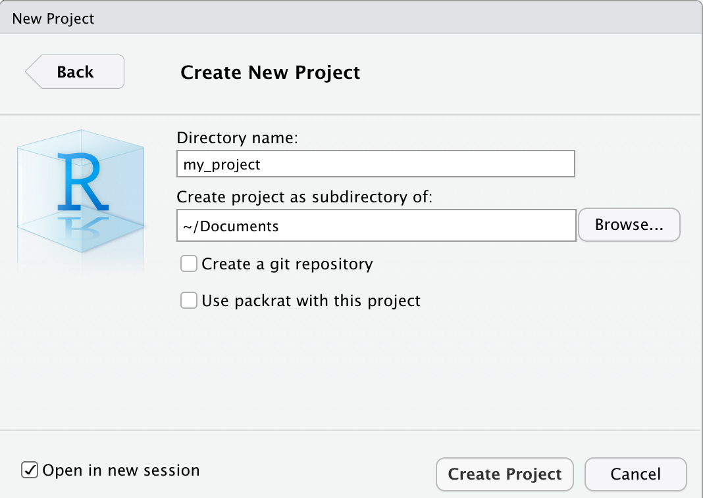
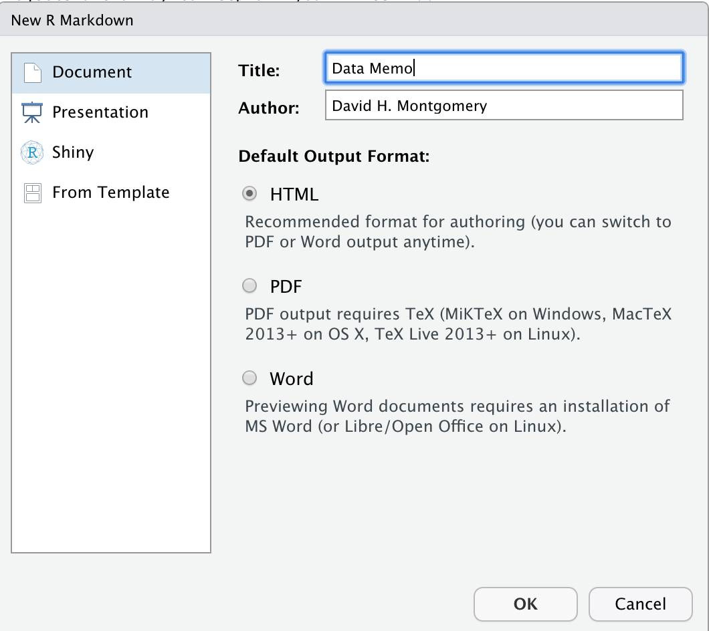
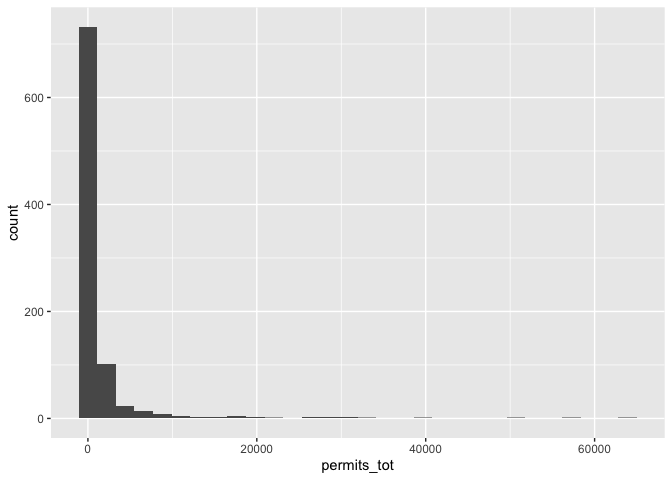
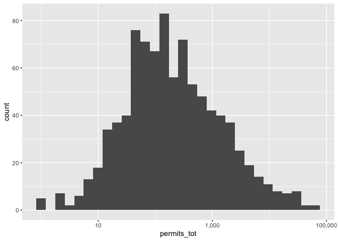
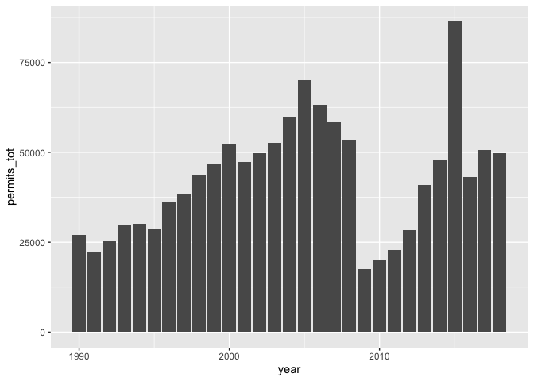
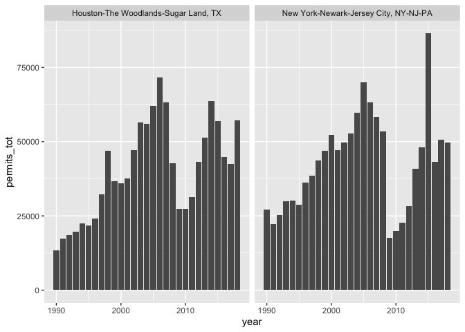
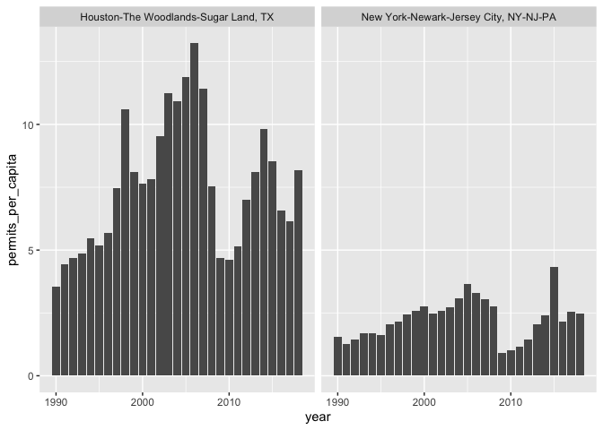
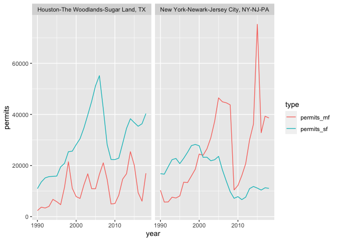

Data journalism with R
================
David H. Montgomery
2/7/2020

***Who this is for:** People who have at least a basic familiarity with
R and RStudio and the Tidyverse, who would like to learn how to use
these tools to do data journalism. If you’re completely new to R, you
can still complete this lesson, but you won’t get as much out of it; I’d
recommend you check out my other lesson, “[R Data for
Beginners](https://github.com/dhmontgomery/r-data-for-beginners).”*

-----

We don’t have time today to complete a publishable work of data
journalism. What we’re going to do instead is do what’s often the first
step in data journalism: writing a memo summarizing what the data tells
us, through words and graphics, and identify what kind of article we’d
write based on this data.

This memo — what I call a “data memo” — is essential to convincing an
editor that this is a story they should run, or possibly to share with
other reporters who you’ll be teaming up with to explain what the data
shows. It’s also vital for helping them engage meaningfully with the
story, even if they aren’t data-savvy themselves.

A data memo like this doesn’t need to have the flashiest graphics. It
might have way too many graphics than could ever run in a publication.
It might spend time exploring tangents. All of that’s fine. The public
won’t see this — the audience is you and other journalists you’re
working with.

We’re going to do this entirely in RStudio. There’s no need to do
analysis in one program, make graphics in another, and combine graphics
and prose together in a third.

## Setup

### Projects

The first thing you want to do is open up RStudio and create a new
Project. Projects are a way to keep all your files for a particular,
well, project, in one place. They eliminate the need to set your working
directory, and let you have separate instances of RStudio open at once
for each project you’re working on.

To do this, click the `File` menu and select `New Project`. Choose “New
Directory”, then “New Project”. Browse to the directory you want to save
this Project in, and type a name for the directory. Finally, check the
box in the bottom left that says “Open in new session”, and click
“Create Project”.



You should get a new, fresh RStudio instance. The difference is that you
can see your Project’s name in the upper-right of your window. As long
as you’ve got a Project open, anything you do in it will automatically
use your Project’s directory as its working directory. If you quit
Rstudio, you can open up the `.Rproj` file that has now appeared in your
directory to reopen RStudio exactly as you left it.

### RMarkdown

The next thing we need to do is open up an RMarkdown document. RMarkdown
is a type of document that lets you easily interweave code, the output
of your code, and text together. I use it as a tool to organize my
programming, but it’s also how we’ll be producing our data memos.

Go to the `File` menu again, mouse over the `New File` submenu, and
select `R Markdown`. You’ll get something that looks like this:



Type in your name and a name for the document you want to create (or
just skip this — you can change this later). Leave the output format on
“HTML”," and click OK.

A document should now have appeared in your screen. Helpfully, new
RMarkdown documents include dummy text that explains how they work.
Essentially they’re divided into two types of text: there are “code
chunks”, which are preceded and followed by groups of three backticks
(`` ` ``) and then curly braces with the letter “r” in them: `{r}`.

Anything inside a code block gets executed as code. Anything not in a
code block gets treated as ordinary text (or specifically, Markdown, a
way of producing formatted text).

You can execute an entire code block by clicking the little green arrow
in the upper right. You can also run individual lines of code my
pressing Control-Enter with your cursor on a line, or with any number of
lines of code selected.

Go to `File` and `Save` your document in your Project folder. (Name it
whatever you want.) Now experiment a little bit with the document for a
minute.

Now try pressing the `Knit` button at the top of the R Markdown
document.

Your R Markdown document was just converted into an HTML document, with
all your code executed and your Markdown converted into formatted text.
You get a preview in RStudio itself, and an HTML file in your Project
folder.

### Customizing our RMarkdown document

The first thing we need to do is set up our RMarkdown document, using
the conveniently labeled `setup` code chunk in your document:

<pre><code>```{r setup, include=FALSE}
knitr::opts_chunk$set(echo = TRUE)
```</code></pre>

This does a few things. The `setup` is the name of your chunk, the first
word you put after the starting `r`. Naming chunks isn’t necessary, but
it can help you stay organized when you make lots of chunks. After the
comma, we have an option for your chunk — telling RMarkdown to not
include this chunk when it knits the document into an HTML file.

Finally, the actual code in the chunk is also setting options for
knitting this document. In this case, it’s setting a default: that when
you knit this document, it will show (or “echo”) all your code in
addition to showing the result of the code. If you changed that `TRUE`
to `FALSE`, then your document would just show the results of the code.
You can set this however you want.

More importantly, we want to add some new lines here. The `setup` chunk
is a perfect place to load the libraries we’re going to need. You’ll
definitely want to load the `tidyverse` collection of packages, and can
add whatever other libraries you want. (You can also come back later to
add libraries here.) I’ve added a few more that I use a lot:

<pre><code>```{r setup, include=FALSE}
knitr::opts_chunk$set(echo = TRUE)
library(tidyverse)
library(scales)
library(lubridate)
```</code></pre>

### References

  - [A guide to Markdown
    formatting](https://rmarkdown.rstudio.com/authoring_basics.html)
  - [In-depth guide to RMarkdown code
    chunks](https://bookdown.org/yihui/rmarkdown/r-code.html)

## Initial analysis

Now we’re finally ready to get some data and take a look at it. I’ve
prepared a spreadsheet with a fascinating dataset, compiled by the
website Apartment List. We can download it directly from a URL:

``` r
housing_data <- read_csv("http://bit.ly/data-week-data")
```

Take a look at it. We’ve got a massive spreadsheet, more than 26,000
rows, with data in eight columns: a `cbsa_code` and `cbsa_name`,
referring to metro areas, a `year`, three columns with data on
“permits”, population, and then `permits_per_capita` (which is
actually per 1,000 residents). In this case, the permits in question are
building permits for homes. `sf` means “single-family”, `mf` means
“multi-family”, and `tot` is “total.”

Explore the data a little bit. Here are some suggested lines of code
that could be helpful:

``` r
summary(housing_data)
length(unique(housing_data$cbsa_name_full))
range(housing_data$year)
housing_data %>% 
    filter(year == max(year)) %>% 
    top_n(25, population) %>% 
    arrange(desc(population))
```

We have data for hundreds of metros over nearly three decades.

### Exploratory visualization

After getting a handle on how the data is structured, my first approach
is always what I call “exploratory visualization” — just throw the data
into a graph and see what patterns emerge. For example, suppose I wanted
to see how many permits different cities issued in 2018:

``` r
housing_data %>%
    filter(year == 2018) %>%
    ggplot(aes(x = permits_tot)) +
    geom_histogram()
```

<!-- -->

That’s not very useful — and that’s fine\! But the fact that almost all
the data is skewed to the left here suggests the data might be
logarithmically distributed. So adding another line to our graph:

``` r
housing_data %>%
    filter(year == 2018) %>%
    ggplot(aes(x = permits_tot)) +
    geom_histogram() +
    scale_x_log10(labels = comma)
```

<!-- -->

We see that the data now looks roughly normally distributed when graphed
on a logarithmic axis. In any case, we can note this and try something
else out.

Perhaps I want to see how New York City’s building permits have changed
over time. To do that, I first need to know what to filter by, so I
create a new code chunk, either by typing it manually or clicking
`Insert` and choosing “R”:

``` r
housing_data %>% filter(population == max(population))
```

    ## # A tibble: 1 x 8
    ##   cbsa_code cbsa_name_full  year permits_sf permits_mf permits_tot population
    ##       <dbl> <chr>          <dbl>      <dbl>      <dbl>       <dbl>      <dbl>
    ## 1     35620 New York-Newa…  2016      10397      32834       43231   20016916
    ## # … with 1 more variable: permits_per_capita <dbl>

Now I can filter and graph:

``` r
housing_data %>% 
    filter(cbsa_code == 35620) %>% 
    ggplot(aes(x = year, y = permits_tot)) +
    geom_col()
```

<!-- -->

Interesting\! Unsurprisingly, NYC has steadily rising permits, for much
of the 1990s and 2000s, then fell off a cliff with the Great Recession
before beginning to rise again.

Now I might want to compare NYC to Houston, a very different type of
city.

``` r
housing_data %>% filter(str_detect(cbsa_name_full, "Houston")) %>% head(1)
```

    ## # A tibble: 1 x 8
    ##   cbsa_code cbsa_name_full  year permits_sf permits_mf permits_tot population
    ##       <dbl> <chr>          <dbl>      <dbl>      <dbl>       <dbl>      <dbl>
    ## 1     26420 Houston-The W…  1990      10963       2358       13321    3773266
    ## # … with 1 more variable: permits_per_capita <dbl>

``` r
housing_data %>%
    filter(cbsa_code %in% c(26420, 35620))  %>%
    ggplot(aes(x = year, y = permits_tot)) +
    geom_col() +
    facet_wrap(vars(cbsa_name_full))
```

<!-- -->

Despite the two metros’ vast differents, they don’t appear that
different\! But maybe there’s more than meets the eye… Here’s what
happens if we plot permits per capita rather than raw permits:

``` r
housing_data %>%
    filter(cbsa_code %in% c(26420, 35620))  %>%
    ggplot(aes(x = year, y = permits_per_capita)) +
    geom_col() +
    facet_wrap(vars(cbsa_name_full))
```

<!-- -->

Further, remember that our data had separate columns for single-family
and multi-family homes?

``` r
housing_data %>%
    filter(cbsa_code %in% c(26420, 35620)) %>%
    gather(key = "type", value = "permits", permits_sf:permits_mf) %>%
    ggplot(aes(x = year, y = permits, color = type)) +
    geom_line() +
    facet_wrap(vars(cbsa_name_full))
```

<!-- -->

Here again we see some start differences: New York’s housing starts are
heavily weighted to multifamily, while Houston is a metro of
single-family homes.

Take about 10 minutes to explore the data yourself. Find interesting
questions you can ask the data. Your goal is to find an angle you might
be able to write an article about. Don’t worry if your first few graphs
aren’t interesting — you’re exploring the data, and hopefully will
eventually find something interesting.

### Tips

  - This can be a big national perspective, or one focused on a single
    city
  - It could look over time, or at a single year, or compare two years.
  - Be creative\! Don’t be afraid to graph a single question in multiple
    different ways

## Writing your memo

Now you hopefully have an angle for a story you want to write. What
we’re going to do now is hone that idea into a more organized data
memo.

Depending on how much you’ve coded in your RMarkdown document, you might
want to open up another one to start fresh from this memo. Just copy and
paste over what you need to the new one, or keep your old one and either
delete chunks or add `include = FALSE` to their options.

What we want to do now is interweave prose with graphics and data. You
can structure it how you, but here’s what often works for me:

  - An introduction, anywhere from one to six paragraphs, introducing
    the topic and concluding with your story pitch boiled down to a
    nutshell.
  - A chart that encapsulates that pitch — the key data fact you want
    readers to take away from your article
  - Explain a couple of different other angles your article could take
    in — different ways of looking at the topic, exceptions or examples,
    etc. Each angle ideally has some words and a chart.
  - Talk about what else you’d do to write the story — who you’d
    interview, what other data sources you’d seek out, what photographs
    should accompany it. What are the unanswered questions you’ll
    answer? What are the unanswered questions that are beyond the
    story’s scope?

Take some time to write something\! Don’t get too in-depth — this is an
exercise, so you don’t need to be quite as thorough as you ordinarily
would if this were an actual pitch.

You can also spend some time here to make your graphs look prettier: try
out a different theme, customize the labels, etc. Whether this is
necessary depends on who you’re sending it to — some pitches you want a
very professional document; other times quick-and-dirty will do the
trick.

## Finishing up

When you’ve got a good draft done, it’s time to knit. Press the “Knit”
button in the top, and look at the preview document that appears.

It almost certainly will have something wrong with it. Maybe you’ll spot
a typo. Maybe a graphic won’t have rendered properly. Maybe you’ll
decide you want to add or change formatting.

Make these revisions, then knit again. Examine the document again. Rinse
and repeat until you have something you’re happy with.

Congratulations\! You now have a data memo that you can use to get
buy-in for a story. Or, if you’re publishing yourself, you have a sort
of first draft that you can expand upon and polish.

## Next steps

So you get approval to pursue your story. How do you go from a data memo
to a published article?

A lot of it is traditional journalism: you need to interview sources,
write the prose, etc. But you’ll also doubtless have data tasks, too.

For example, you’ll need to identify which graphs are most important to
tell the story. You might have made graphs for your memo that aren’t
important to publish, or there might be a graph that you didn’t make
that you now need to. There may be a data question you need to answer;
perhaps you want the exact number of building permits New York City
issued in 2013 to cite in your story, or the percent increase from 2009
to 2018. Go do that math.

If you didn’t before, now’s also the time to polish your graphics. Apply
styles, customize labels, format your axes, pick an aspect ratio. Make
sure your visual choices are the right ones — should this really be a
line graph, or would bars be a better choice? Should this graph be
`coord_flip()`ed and run with its axes switched? Could you choose better
colors? There’s no science to this, just a lot of trial and error.

Show your drafts to other people. Get their feedback. Ideally you’ll
show them to both data people and non-data people, as the feedback you
get can be very different.
